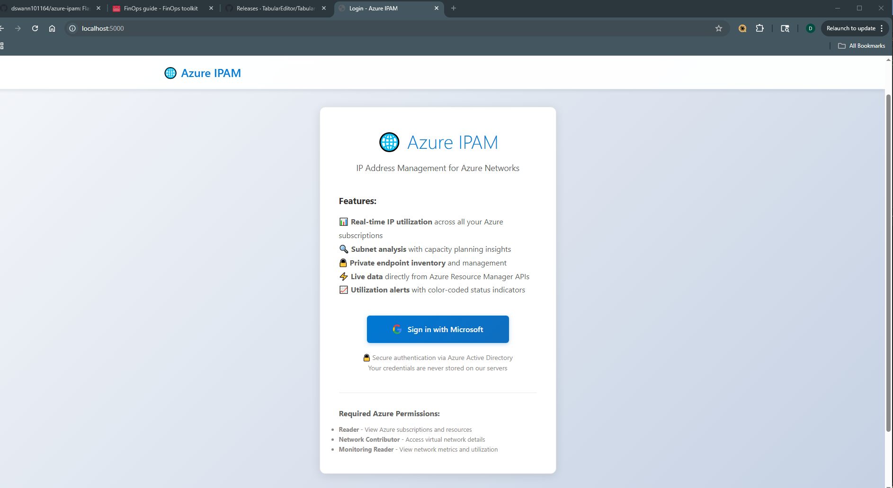
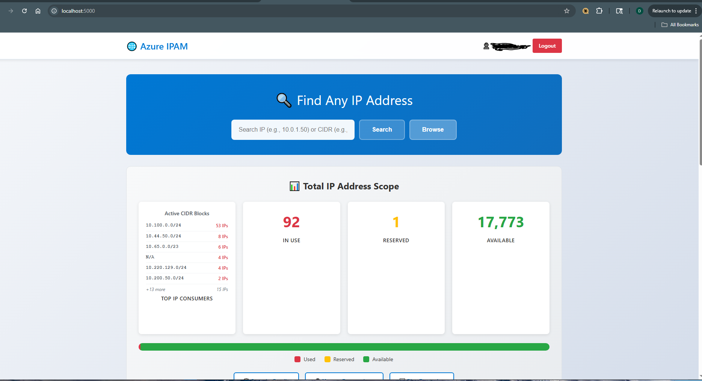
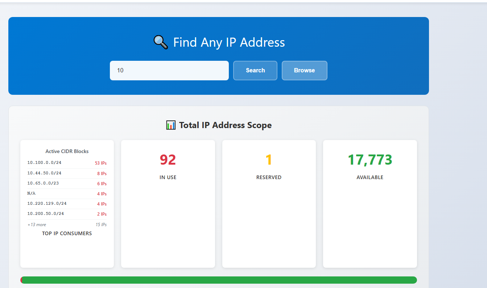
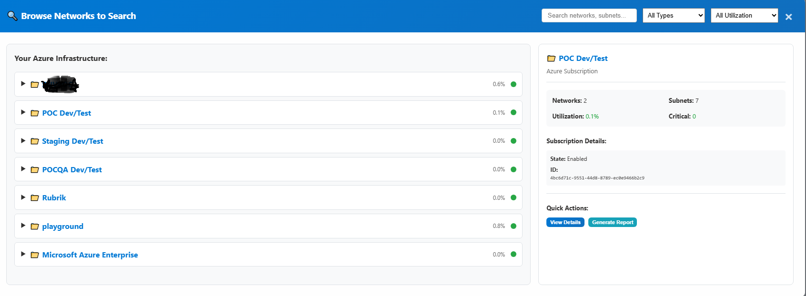
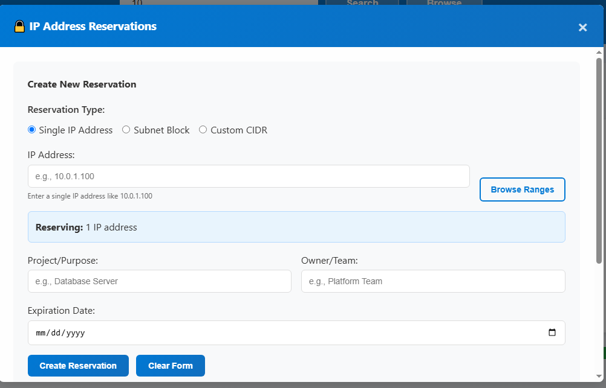
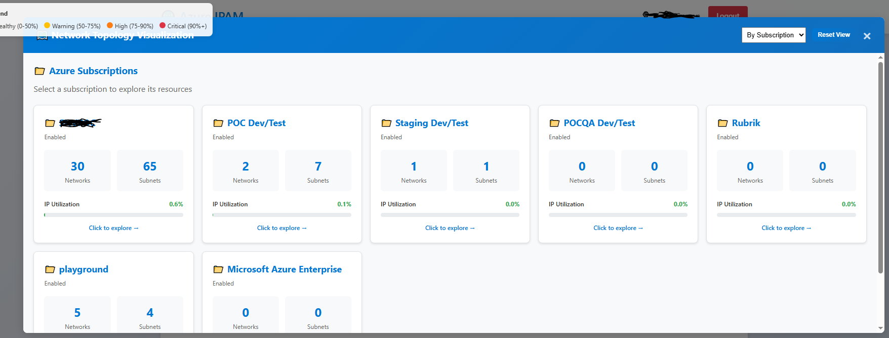

# Azure IPAM Tool

A Flask-based IP Address Management (IPAM) tool for tracking and managing IP address allocation across multiple Azure subscriptions. Built for enterprise environments consolidating large Azure footprints.

## What It Does

Provides real-time visibility into IP address utilization across your Azure environment:

- **Multi-subscription IP tracking** - Scan all VNets and subnets across subscriptions
- **Accurate utilization metrics** - Shows used, available, and reserved IPs with Azure's 5 reserved IPs per subnet factored in
- **IP address search** - Find which subnet contains any IP or CIDR block
- **Reservation system** - Reserve IP ranges for future use with purpose tracking
- **Capacity planning** - Identify subnets approaching capacity (>75%, >90%)
- **Network topology visualization** - D3.js-based visual representation of your network hierarchy
- **Export capabilities** - Generate reports for capacity planning meetings

Perfect for Azure Architects managing subscription consolidations, mergers, or large multi-tenant environments.

## Prerequisites

- Python 3.8+
- Azure tenant with subscriptions you want to monitor
- Azure AD App Registration with appropriate permissions
- Network Contributor or Reader role on target subscriptions

## Azure AD App Registration

Before running the tool, create an Azure AD app registration:

1. **Go to Azure Portal** → Azure Active Directory → App registrations → New registration
2. **Name**: `Azure IPAM Tool` (or your preference)
3. **Supported account types**: Single tenant
4. **Redirect URI**: 
   - Platform: Web
   - URI: `http://localhost:5000/auth/callback`
5. Click **Register**

6. **Note your Application (client) ID and Directory (tenant) ID** from the Overview page

7. **Create a client secret**:
   - Certificates & secrets → New client secret
   - Description: `IPAM Tool Secret`
   - Expires: Choose appropriate duration
   - Copy the **Value** (not Secret ID) immediately - you can't retrieve it later

8. **Add API permissions**:
   - API permissions → Add a permission
   - **Microsoft Graph**:
     - Delegated permissions: `User.Read`
   - **Azure Service Management**:
     - Delegated permissions: `user_impersonation`
   - Click "Grant admin consent" if you have admin rights

9. **Assign Azure RBAC roles**:
   - Go to Subscriptions → Select subscription → Access control (IAM)
   - Add role assignment → Reader (or Network Contributor)
   - Select your app registration
   - Repeat for each subscription you want to monitor

## Installation

```bash
# Clone the repository
git clone https://github.com/yourusername/azure-ipam.git
cd azure-ipam

# Create virtual environment
python -m venv venv

# Activate virtual environment
# Windows:
venv\Scripts\activate
# Linux/Mac:
source venv/bin/activate

# Install dependencies
pip install -r requirements.txt

# Create .env file from template
cp .env.example .env
```

## Configuration

Edit `.env` file with your Azure AD app details:

```bash
CLIENT_ID=your-application-client-id
CLIENT_SECRET=your-client-secret-value
TENANT_ID=your-tenant-id
SECRET_KEY=generate-random-secret-key
```

**Generate SECRET_KEY**:
```python
python -c "import secrets; print(secrets.token_urlsafe(32))"
```

## Running the Application

```bash
# Activate virtual environment if not already active
venv\Scripts\activate  # Windows
source venv/bin/activate  # Linux/Mac

# Run Flask app
python app.py
```

Visit `http://localhost:5000` in your browser.

## Features

### IP Scope Overview
- Total IP capacity across all subscriptions
- Used, reserved, and available IP breakdown
- Visual progress bar with color-coded utilization
- Active CIDR blocks with usage metrics

### Multi-Subscription Support
- Automatically discovers all subscriptions your app has access to
- Concurrent scanning of multiple subscriptions
- Subscription-level filtering and drill-down

### IP Address Search
- Search for specific IPs or CIDR blocks
- Identifies which subnet contains the IP
- Shows utilization and available capacity
- Lists resources consuming IPs in that subnet

### Capacity Alerts
- Automatic alerts for subnets >90% utilized
- Warning notifications for 75-90% utilization
- Proactive planning recommendations

### IP Reservation System
- Reserve single IPs, subnets, or custom CIDR blocks
- Track purpose, owner, and expiration
- Browser-based selection from available ranges
- Prevents double-allocation during planning

### Network Topology Visualization
- Interactive D3.js network diagram
- Color-coded by utilization status
- Hierarchical view: Subscription → VNet → Subnet
- Click to view detailed metrics

---

## Screenshots

### Authentication

*Enterprise SSO with Azure AD - request required permissions on first login*

### Dashboard Overview

*Real-time IP scope utilization across all subscriptions*

### IP Address Search

*Find available IPs across VNets with subnet filtering*

### Network Browser

*Navigate subscription hierarchy to find specific VNets and subnets*

### IP Reservations

*Reserve IPs for future use with three reservation types: NIC, Private Endpoint, or General*

### Topology View

*Visual network topology showing relationships across subscriptions*

---

## Usage Scenarios

### Subscription Consolidation
During Azure subscription mergers (e.g., company acquisition):
1. Scan both environments to identify IP conflicts
2. Use reservation system to plan non-overlapping address spaces
3. Generate capacity reports for leadership
4. Monitor post-migration to ensure proper allocation

### IP Conflict Detection
Before deploying new workloads:
1. Search for desired IP range
2. Verify availability across all subscriptions
3. Reserve the range with deployment ticket reference
4. Deploy with confidence

### Capacity Planning
For quarterly infrastructure reviews:
1. Review critical subnets (>90% utilization)
2. Export subnet utilization report
3. Plan expansion for high-growth areas
4. Present topology visualization to stakeholders

## Known Limitations

- **Reservation storage**: Currently uses browser localStorage. Reservations are per-browser and not shared across users. For production use with teams, implement server-side storage (database).

- **Private endpoint IP consumption**: Azure private endpoints consume unpredictable IP space. Tool tracks them but can't predict future consumption.

- **Refresh rate**: Data is fetched on page load. For environments with frequent changes, implement auto-refresh or caching.

- **Large environments**: Scanning 44+ subscriptions can take 30-60 seconds on initial load. Consider implementing background job queue for very large deployments.

- **Authentication**: Uses OAuth device code flow. For production deployment, implement proper session management and token refresh.

## Deployment Options

### Local Development
Included by default. Runs on `http://localhost:5000`.

### Docker (Coming Soon)
Containerized deployment for sandbox or production use.

### Azure Container Instances
Deploy to Azure for team access:
1. Package as Docker container
2. Deploy to Azure Container Instances with VNet integration
3. Configure private endpoint for security
4. Use managed identity instead of client secret

### Azure App Service
Production deployment with private endpoint:
1. Deploy to App Service
2. Enable VNet integration
3. Configure private endpoint for internal-only access
4. Use managed identity for Azure authentication

## Security Considerations

- **Never commit `.env` file** - Contains sensitive credentials
- **Rotate client secrets regularly** - Follow your organization's secret management policy
- **Use managed identity in production** - Avoid storing secrets in App Service
- **Restrict RBAC permissions** - Reader role is sufficient; avoid unnecessary Contributor access
- **Enable private endpoints** - For production deployment in banking/regulated environments
- **Audit access logs** - Monitor who's viewing IP allocation data

## Contributing

This tool was built to solve real enterprise Azure consolidation challenges. Contributions welcome:

- Submit issues for bugs or feature requests
- Pull requests for enhancements
- Share your deployment scenarios and improvements

## License

MIT License - See LICENSE file for details

## Acknowledgments

Built by Azure Architects solving real-world IP management problems during large-scale subscription consolidations. Documented at [azure-noob.com](https://azure-noob.com).

## Troubleshooting

**"Failed to acquire Azure Resource Manager token"**
- Verify API permissions include Azure Service Management `user_impersonation`
- Confirm admin consent granted for tenant
- Check RBAC role assignments on subscriptions

**"No subscriptions found"**
- Verify app registration has Reader role on target subscriptions
- Check that subscriptions are in the same tenant as app registration
- Confirm CLIENT_ID, CLIENT_SECRET, and TENANT_ID are correct in `.env`

**"Authentication failed"**
- Verify redirect URI in Azure AD matches `http://localhost:5000/auth/callback`
- Check that client secret hasn't expired
- Ensure browser allows cookies for authentication flow

**IP counts seem wrong**
- Tool automatically subtracts Azure's 5 reserved IPs per subnet
- Verify subnet has resources deployed (empty subnets show 0 used IPs)
- Check for private endpoints which consume unpredictable IP space